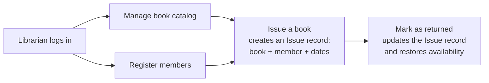
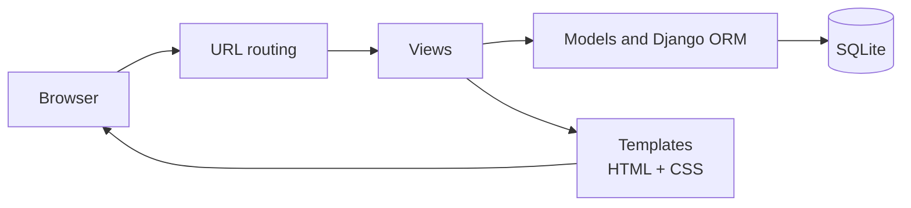

# Library Management System


A web-based library management application built with Django. It lets a librarian manage books, register members and track issues and returns from one clean interface.


---

## Overview

Library Management System is a full-stack Django application that digitizes day-to-day library operations: cataloguing books, registering members, and tracking which book is issued to whom and when it is due back.

It was built as a solo project and follows Django's Model-View-Template (MVT) architecture, with custom HTML and CSS templates. The project covers core full-stack fundamentals: relational data modelling, server-side rendering, CRUD operations and form handling.

## Key Features

### Book management

- Add, edit and delete book records
- Track title, author, genre, ISBN and available copies
- Organized, searchable catalog view


### Member management

- Register new members with contact details
- View and manage the full member directory
- Edit or remove member records


### Issue and return tracking

- Issue a book to a registered member
- Record the issue date and due date
- Mark a book as returned, which updates availability automatically
- See currently issued and overdue books at a glance


### Interface

- Custom HTML and CSS templates, with no heavy frontend framework
- Simple, readable layout focused on usability
- Django template inheritance for consistent page structure
- Django Admin panel for administrative access


## How It Works



## Architecture




## Tech Stack

| Layer | Technology |
|---|---|
| Backend framework | Django (Python) |
| Database | SQLite through the Django ORM |
| Frontend | HTML5, CSS3 |
| Architecture | MVT (Model-View-Template) |
| Admin interface | Django Admin |

## Project Structure


## Getting Started

### Prerequisites

- Python 3.10 or later
- pip

### Installation

```bash
git clone https://github.com/swethakannan595-crypto/library-management-system.git
cd library-management-system
```

Create and activate a virtual environment:

```bash
# Windows
python -m venv venv
venv\Scripts\activate

# macOS / Linux
python3 -m venv venv
source venv/bin/activate
```

Install dependencies:

```bash
pip install -r requirements.txt
```

### Database setup

```bash
python manage.py makemigrations
python manage.py migrate
python manage.py createsuperuser
```

### Run the server

```bash
python manage.py runserver
```

| Page | URL |
|---|---|
| Application | http://127.0.0.1:8000 |
| Django Admin | http://127.0.0.1:8000/admin |

## Roadmap

- [ ] Member login and self-service portal
- [ ] Fine calculation for overdue books
- [ ] Email and SMS due-date reminders
- [ ] Book cover image uploads
- [ ] Advanced filters by genre, author and availability
- [ ] Export reports (issued and overdue books) as PDF or CSV
- [ ] REST API layer with Django REST Framework
- [ ] Deployment (Render, Railway or PythonAnywhere)

## Concepts Demonstrated

Django, Python, MVT architecture, relational database design, CRUD operations, form handling, Django Admin, HTML and CSS, full-stack development.

## Author

**Swetha Kannan**
B.Sc. Information Technology
[GitHub](https://github.com/swethakannan595-crypto)

## License

Released under the MIT License. See [LICENSE](LICENSE) for details.
